## Autores

- António Antunes (a22202276) - [@TunaPT](https://www.github.com/TunaPT)
- João Serralha (a22202133) - [@Shadow10Z](https://www.github.com/Shadow10Z)

## Imagens de Ecrãs

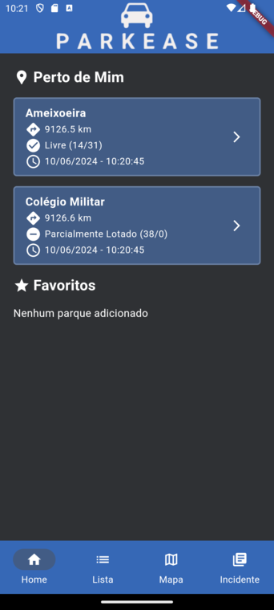
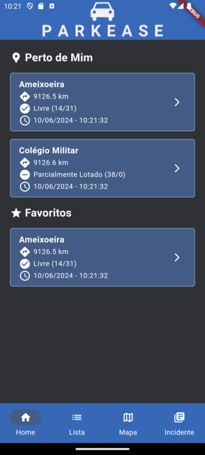
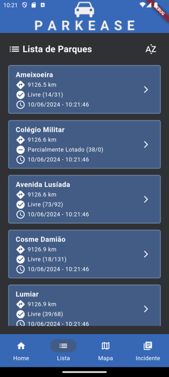
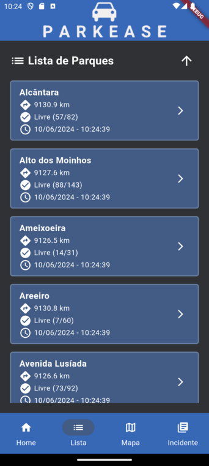
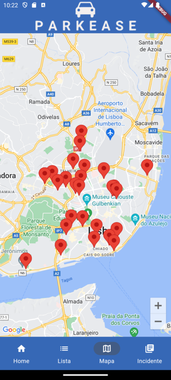
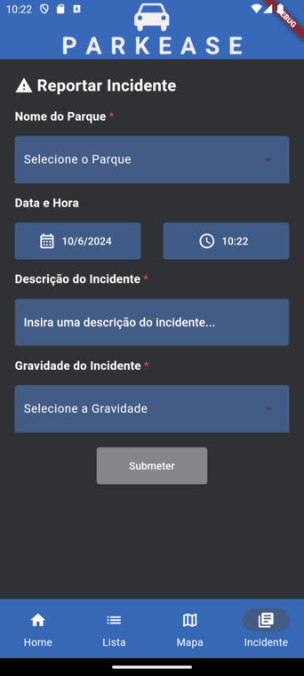
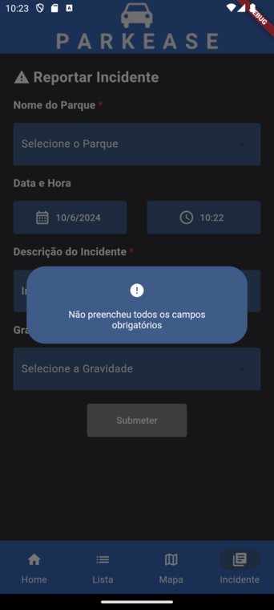
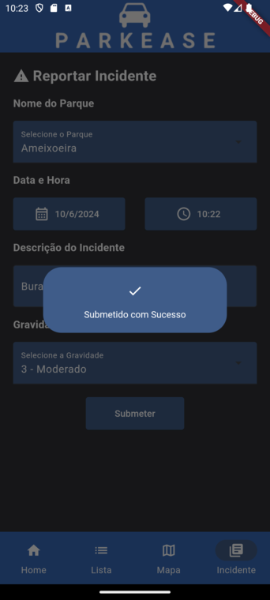
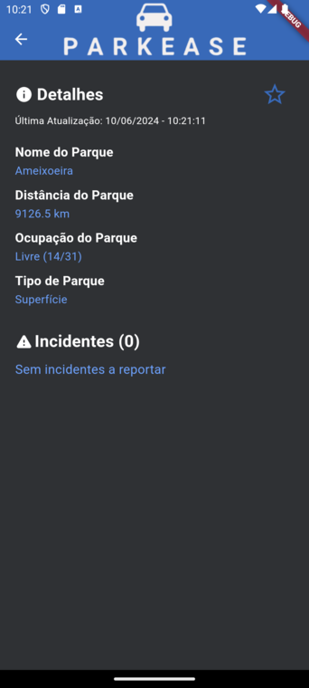
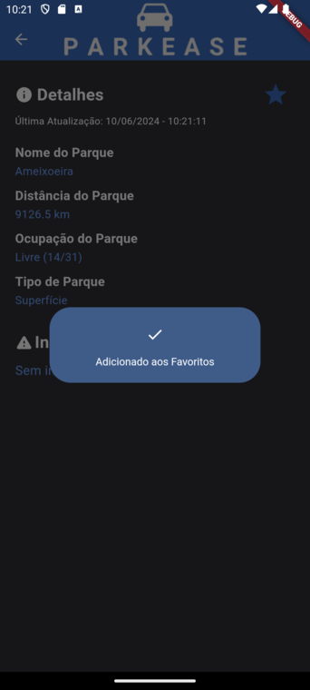
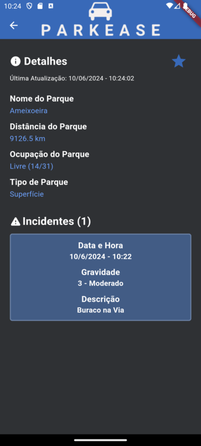
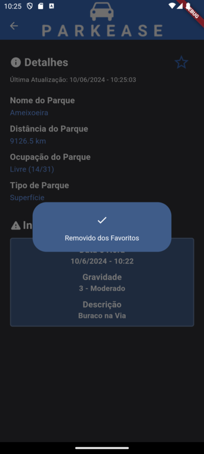

## Tabela de Funcionalidades

| Descrição                        | Funcionalidade
|----------------------------------|----------------------------------
| Dashboard                        | Ecrã com as características principais da aplicação. Desenvolvido a possibilidade do utilizador visualizar os dois parques mais próximos de si. O ecrã dispõe ainda uma secção para os favoritos, onde é apresentado por ordem alfabética os parques selecionados como favorito.
| Apresentação dos Parques - Lista | Ecrã com a lista de parques. Desenvolvido a possibilidade de filtrar os parques por distância e por nome. Cada elemento da lista dispõe do nome do parque, distância ao parque, estado de ocupação e última hora de atualização dos dados. Cada elemento redireciona para a página de detalhes do respetivo parque.
| Apresentação dos Parques - Mapa  | Ecrã que contém uma imagem de mapa. Brevemente irá apresentar os respetivos parques
| Detalhe do Parque                | Ecrã que dispõe as informações de um parque. Disponível o nome do parque, ocupação, tipo de parque e coordenadas. Desenvolvido a opção de adicionar e remover um parque como favorito, onde é apresentado um alerta para informar o utilizador dessa ação. Adicionado secção de incidentes do respetivo parque, que mostra a quantidade de incidentes e os seus respetivos dados, como hora do incidente, gravidade e descrição.
| Registo de Incidentes            | Ecrã que permite reportar um incidente de um parque específico. Possibilidade de selecionar o parque a partir de uma lista, utilizado um calendário para a escolha da data e um campo para a escolha da hora, adicionado um campo para a descrição do incidente e uma opção para escolher a gravidade. Os dados são validados com base na introdução dos mesmos por parte do utilizador. Caso todos os dados não sejam preenchidos ou sejam apagados, não é possível submeter o incidente. Ao submeter um incidente, é apresentado um alerta a informar da submissão com sucesso e redireciona o utilizador para a página principal
| Navegação                        | Desenvolvido barra de navegação para navegar entre as diferentes páginas de dashboard, lista de parques, mapa e registo de incidentes
| Arquitetura da Aplicação         | Dividida a lógica da aplicação em model, pages e repository

## Previsão de Nota

- 18 (Parte 1)
- 16 (Parte 2)

## Arquitetura

1. Widgets e componentes UI
    - Utilização de componentes UI individuais que apresentam uma interface visual, na forma de stateless e stateful widgets, que permitem apenas o redesenho de widgets específicos, ao invés de várias partes ao mesmo tempo. São responsáveis por várias operações na aplicação, como a listagem de parques.

2. Modelo de negócio
    - Utilização de pacotes de providers que servem para gerir estados e injeção de dependências. Como existem vários widgets a aceder a um só modelo, é preciso instanciar as classes no main e injetá-las. O uso de operações assíncronas são usadas para esperar por algo exterior como o querying de uma base de dados, o que leva tempo. Para tal, são usadas funções async que produzem sempre o futuro. Em vez de bloquear toda a computação até que o resultado esteja disponível, a computação assíncrona retorna imediatamente um Future que eventualmente será "concluído" com o resultado.

3. Utilização de base de dados
    - O uso de uma base de dados SQLite, permite fazer operações sem a utilização de variáveis. São utilizadas operações CRUD para os parques favoritos e incidentes.

4. Repositório dos parques
    - Os dados dos parques vêm diretamente da API da EMEL, porém quando fazemos o pedido de acesso, para além dessa informação, é importante saber se a resposta foi dada com sucesso ou não (e em caso de erro, saber que erro foi) através de um código de status. 

## Vídeo

- [Apresentação do Trabalho]()

## Lógica de Negócio

1. Classe ParkDataBase:
    - Atributos:
        * _database - Database?
    - Métodos:
        * Future<void> init()
        * Future<void> createIncidentsTable()
        * Future<void> createFavouriteParksTable()
        * Future<List<Incident>> getIncidentsForPark(String parkName)
        * Future<void> insertIncident(Incident incident)
        * Future<int> getIsParkFavourite(String parkName)
        * Future<List<FavouritePark>> getFavouriteParks()
        * Future<void> insertFavouritePark(FavouritePark favouritePark)
        * Future<void> deleteFavouritePark(String parkName)

1. Classe Parks:
    - Atributos:
        * _client - HttpClient
    - Métodos:
        * Future<Null> getParkInfo()
        * Future<List<ParkInfo>> getParks()
        * Future<ParkInfo> getParkData(String parkName)

2. Classe FavouritePark:
    - Atributos:
        * parkName - String
    - Métodos:
        * Map<String, dynamic> toDb()

3. Class Incident:
    - Atributos:
        * parkName - String
        * dateTime - DateTime
        * description - String
        * gravity - String
    - Métodos:
        * Map<String, dynamic> toDb()

4. Classe ParkInfo:
    - Atributos:
        * name - String
        * type - String
        * latitude - String
        * longitude - String
        * occupation - int
        * occupationData - String
        * capacity - int
    - Métodos:
        * OccupationStatus calculateAvailability()
        * String availabilityText(OccupationStatus occupationState)

## Fontes de Informação

- [Flutter Dev Docs](https://docs.flutter.dev/)
- [Google Maps API](https://developers.google.com/maps)
